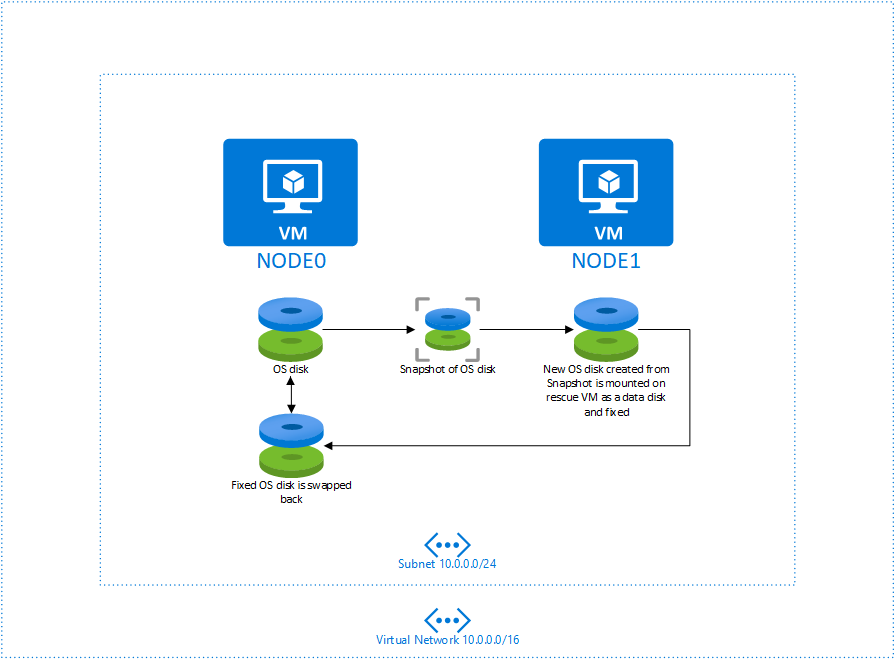

# Overview
This project was created to test and fix the problem introduced when migrating major SP versions of SLES12 and SLES15 on Azure instance types which support secure boot.  SUSE has published a TID describing the issue:  
https://www.suse.com/support/kb/doc/?id=000019919  
The lab.yml Ansible playbook in the root of the repo will utilize Ansible's Terraform module to create the resources in Azure.  
2 nodes will be created.  
Node0 is the system that SLES SP1 will be upgraded to either SP2 or SP3.  
Node1 is the rescue VM where the Snapshot of Node0's OS disk will be attached as a data disk.  
By default, Node0 is imaged with "SUSE:sles-15-sp1:gen2:latest" and will be upgraded to SP2.  
A chroot environment will be created on the rescue VM and Node0's OS disk will be repaired.  
Node1 will be deallocated and the fixed OS disk which is attached to Node1 as a data disk will be swapped back to Node0 as an OS disk.  
Node0 will be started and you can check the serial console or SSH to Node0 to check if it booted successfully.  See Tips section for more SSH information.
# Installation
## Requires the latest Terraform and Ansible
Azure Cloudshell has both Terraform and Ansible preinstalled, so cloning and launching from Cloudshell is convienent.
## Installation in your local Linux environment 
Cloudshell in the Portal times out after 20 minutes, so installing in your local environment or Linux VM is a good option.  If you use Cloudshell, you will have to hit the keyboard every now and then to prevent a timeout.
### Links to install requirements
- az CLI
    1. https://docs.microsoft.com/en-us/cli/azure/install-azure-cli-linux?pivots=apt
- Terraform
    1. https://learn.hashicorp.com/tutorials/terraform/install-cli
- Ansible    
    1. https://docs.ansible.com/ansible/latest/installation_guide/intro_installation.html#installing-ansible-on-specific-operating-systems

# Run the playbook
### Login az CLI:
```console
$ az login
```  
### Clone the repository and run this command from root of project folder:
```console
$ ansible-playbook -i myazure_rm.yml lab.yml
```  
The resources will be created in a resource group specified in the root of the repo's main.tf.

# Deleting the environment
### The cluster can be deprovisioned by running:
```console
$ terraform delete
```  
You can also simply delete the resource group the cluster is in.  If you manually delete the resource group, terraform will leave behind the files:
1. terraform.tfstate
1. terraform.tfstate.backup

Delete the tfstate files and you ready to spin up another cluster.  If you do not want to wait for the previous resource group to be deleted, you can create a new resource group name in main.tf, and the new resources will be spun up in the new resource group.

# Tips

### SSH Keys
If you do not already have SSH keys setup in your home directory, they will be created for you.  The public keys will be installed on both the nodes.  The username you should login with is 'azadmin'.  If you already have SSH keys setup, you can login with your existing keys with the 'azadmin' user, as your existing keys will be distributed to both nodes.

### Changing the instance size or image
The main.tf in the root of the repo calls the node module to create the nodes
```hcl
module "node0" {
  source = "./modules/node"
  rg = module.rg0.rg
  region = module.network0.region
  subnet = module.network0.subnet
  NSGid = module.NSG0.NSGid
  console = module.storage_account0.console
  size = "Standard_B2ms"     #<-----------------THIS LINE TO CHANGE INSTANCE SIZE 
  publisher = "SUSE"         ###
  offer = "sles-sap-15-sp1"  ###<---------------THESE LINES TO CHANGE IMAGE
  sku = "gen2"               ###
  _version = "latest"        ###
  tag = "node0"
}
```

### Changing the version of SP upgrade
```yml
- name: Migration
  hosts: tag_group_node0
  remote_user: azadmin
  become: yes
  tasks:
  - name: Migration
    command: zypper migration --migration 2 --non-interactive --auto-agree-with-licenses
    args:
      creates: /tmp/migration_attempted_delete_this_to_retry
```
Take a look at the 'lab.yml' Ansible playbook in the root of the repo.  The zypper migration command is run with the argument '--migration 2'.  The argument represents menu item 2 in the migration menu, and will upgrade the system to SP2.  Change the argument to '--migration 1' to upgrade the system to SP3. Depending on the version of SLES you are migrating from, these menu options may be numbered differently, so manually run the 'zypper migration' command and check the menu when in doubt.

```console
Available migrations:

    1 | SUSE Linux Enterprise Server 15 SP3 x86_64
        Basesystem Module 15 SP3 x86_64
        Containers Module 15 SP3 x86_64
        Desktop Applications Module 15 SP3 x86_64
        Python 2 Module 15 SP3 x86_64
        Server Applications Module 15 SP3 x86_64
        SUSE Cloud Application Platform Tools Module 15 SP3 x86_64
        Development Tools Module 15 SP3 x86_64
        Legacy Module 15 SP3 x86_64
        Public Cloud Module 15 SP3 x86_64
        Web and Scripting Module 15 SP3 x86_64

    2 | SUSE Linux Enterprise Server 15 SP2 x86_64
        Basesystem Module 15 SP2 x86_64
        Containers Module 15 SP2 x86_64
        Desktop Applications Module 15 SP2 x86_64
        Python 2 Module 15 SP2 x86_64
        Server Applications Module 15 SP2 x86_64
        SUSE Cloud Application Platform Tools Module 15 SP2 x86_64
        Development Tools Module 15 SP2 x86_64
        Legacy Module 15 SP2 x86_64
        Public Cloud Module 15 SP2 x86_64
        Web and Scripting Module 15 SP2 x86_64


[num/q]:
```
